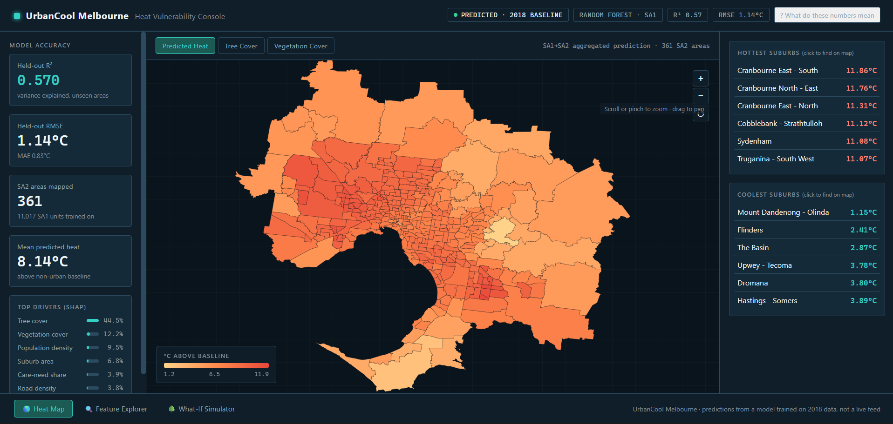
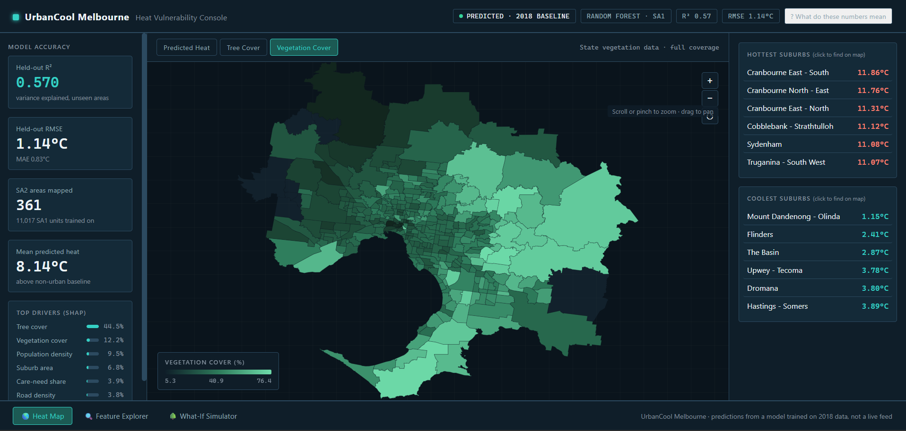
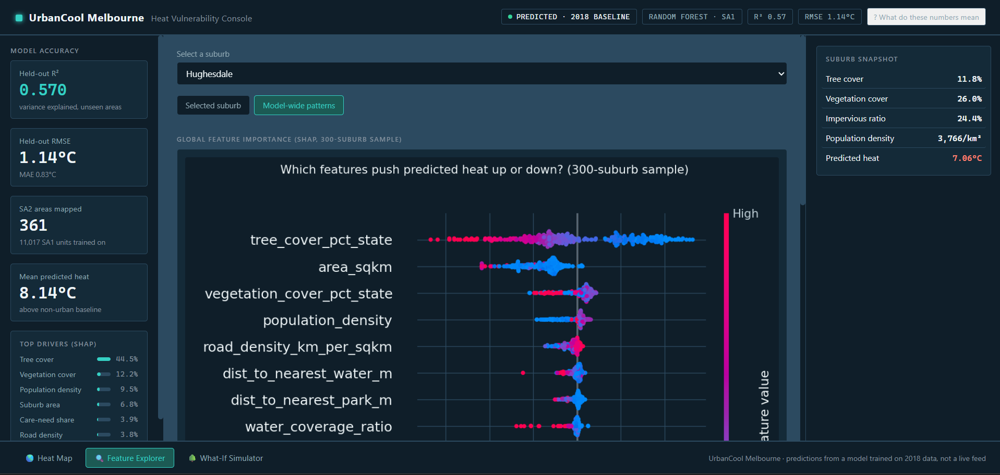
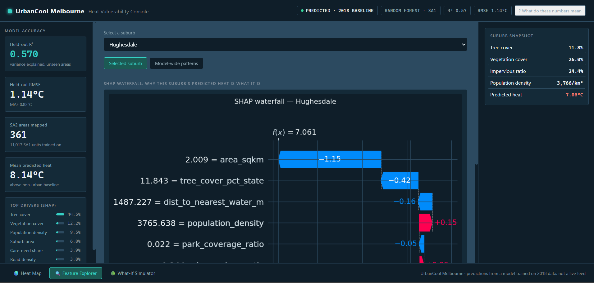
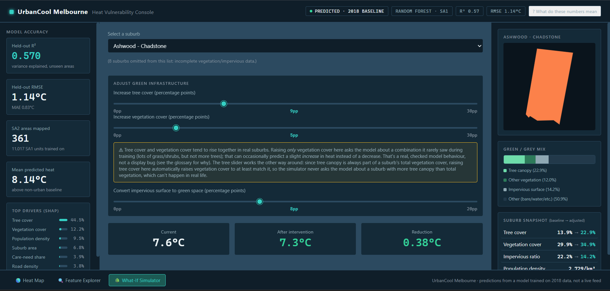

# UrbanCool Melbourne

[](https://github.com/duytrangiale/urbancool_melbourne/actions/workflows/tests.yml)
[](LICENSE)

**ML-powered urban heat vulnerability mapping for Greater Melbourne.**

UrbanCool Melbourne fuses Victorian Government urban heat island and vegetation cover polygons, City of Melbourne tree/canopy data, OpenStreetMap urban morphology, Bureau of Meteorology weather records, and ABS Census demographics to train a Random Forest model that identifies which SA2 areas (suburbs) are most vulnerable during heatwaves. The deliverable is a FastAPI + static-console dashboard with an interactive heat map, SHAP-based explanations, and a "what-if" green-infrastructure simulator.

**[Live demo](https://urbancool-melbourne.onrender.com/)** (hosted on a free tier that sleeps after 15 minutes of inactivity, so the first load after a while can take 30-60 seconds to wake up).

## Results

- **Held-out spatial test set** (SA1 resolution, 11,017 training rows across 353 SA2 groups, trained/tested on disjoint groups so no suburb leaks between train and test): **R² = 0.570, RMSE = 1.14°C, MAE = 0.83°C**.
- **Strongest predictors** (SHAP feature importance): tree cover (44%) dominates, well ahead of overall vegetation cover (12%), population density (9%), and suburb area (7%). Tree canopy specifically, not green space in general, is the model's main cooling signal. See the dashboard's Feature Explorer tab for the full SHAP breakdown.
- **Random Forest tuned to 100 trees**, not the highest-scoring configuration found during search (500 trees scored marginally better: R² 0.5715 vs 0.5698), traded off deliberately to fit the deployed dashboard's free-tier memory budget. The difference is within normal training noise.

## Screenshots

| | |
|---|---|
|  Heat Map: predicted heat above non-urban baseline, per SA2 area |  Heat Map: vegetation cover layer toggle |
|  Feature Explorer: model-wide SHAP feature importance |  Feature Explorer: per-suburb SHAP waterfall |
|  What-If Simulator: live green-infrastructure re-prediction | |

## Data Sources

| # | Source | Role | Access |
|---|--------|------|--------|
| 1 | [Vic Planning: vegetation, heat & land use data](https://www.planning.vic.gov.au/guides-and-resources/Data-spatial-and-insights/melbournes-vegetation-heat-and-land-use-data) | Target variable (urban heat island / heat vulnerability index polygons) | Manual order via DataShare Vic cart checkout (no public API); see `download_urban_heat_data()` for direct dataset links |
| 2 | [City of Melbourne: tree inventory](https://data.melbourne.vic.gov.au/explore/dataset/trees-with-species-and-dimensions-urban-forest/) | Tree density, species, health features | Automated (Open Data API) |
| 3 | [City of Melbourne: tree canopy polygons](https://data.melbourne.vic.gov.au/explore/dataset/tree-canopies-2021-urban-forest/) | Canopy coverage ratio | Automated (Open Data API) |
| 4 | OpenStreetMap via `osmnx` | Building density, roads, parks, water | Automated |
| 5 | [BOM climate data](http://www.bom.gov.au/climate/data/) | Contextual weather features | Automated (recent obs) / manual (full historical) |
| 6 | [ABS: SA2 boundaries](https://www.abs.gov.au/statistics/standards/australian-statistical-geography-standard-asgs-edition-3) | Spatial unit boundaries | Automated |

## Setup

```bash
python -m venv .venv
source .venv/Scripts/activate   # Windows Git Bash; use .venv\Scripts\Activate.ps1 for PowerShell
pip install -r requirements.txt
cp .env.example .env            # fill in any optional API keys
```

## Downloading Raw Data

```bash
python -m src.data.download
```

This fetches everything that has a public API (trees, tree canopies, OSM features, BOM recent observations, ABS SA2 boundaries) into `data/raw/`. The Victorian Government urban heat data has no public API and must be downloaded manually. The script prints instructions when run.

Validate what landed in `data/raw/`:

```bash
python -m src.data.validation
```

## Running the Pipeline

Once raw data is downloaded and validated:

```bash
python -m src.data.loaders         # clean raw data -> data/interim/*.parquet
python -m src.features.spatial     # build feature_matrix.csv + feature_matrix_sa1.csv
python -m src.models.train         # train, tune, and save models/best_model.joblib
python -m src.models.predict       # predictions -> data/processed/predictions_sa1.csv / predictions_sa2.csv
python -m src.visualization.maps   # optional standalone Folium map -> outputs/heat_vulnerability_map.html
python -m app.build_static         # bake the dashboard's map/KPIs/charts -> app/static/index.html
uvicorn app.main:app --reload      # launch the dashboard at localhost:8000
pytest tests/ -v                   # run the test suite
```

## Deploying

The dashboard (`app/`) is a plain FastAPI app with a static HTML/CSS/JS frontend, packaged
by the repo-root `Dockerfile`. It'll run on any host that can build and run a Docker
image and route traffic to port `7860`, or the `PORT` environment variable if the host
sets one (Render does; the Dockerfile's `CMD` handles both).

**Live demo runs on [Render](https://render.com)**, free tier, built from this repo's
`deploy` branch rather than `main`. The reason for the separate branch: `models/`,
`data/interim/sa2_boundaries.parquet`, and `data/processed/predictions_sa2.csv` are
gitignored from `main` (they're large, regenerable build artifacts, see `.gitignore`),
but the Dockerfile's `COPY` steps need those specific files present in the build context,
and Render builds directly from a GitHub branch rather than a local Docker context. To
reproduce:

```bash
# Run the "Running the Pipeline" commands above locally first, then:
git checkout -b deploy
git add -f data/interim/sa2_boundaries.parquet data/processed/predictions_sa2.csv \
           models/best_model.joblib models/model_info.json \
           models/test_metrics.json models/feature_importance.csv
git commit -m "Add data/model artifacts for the Docker build context"
git push origin deploy
```

Then on Render: **New → Web Service** → connect this repo → set **Branch** to `deploy` →
Render detects the `Dockerfile` automatically → **Instance type: Free**. Any future change
to `main` needs merging into `deploy` before Render will pick it up.

**Note on Hugging Face Spaces**: this was the original deployment target, but Hugging
Face moved Docker/Gradio Space hosting behind a paid PRO subscription partway through
this project, so the live demo above runs on Render's free tier instead. The
Dockerfile itself is unchanged either way; with a HF PRO account, the same build context
(the `deploy` branch above) pushed to a Space's own git remote would work identically.

## Configuration

Study area, CRS (`EPSG:28355`, GDA94 / MGA Zone 55), spatial unit (SA2), and data source parameters live in [config/settings.yaml](config/settings.yaml).

## Project Structure

```
urbancool-melbourne/
├── config/settings.yaml   # Paths, CRS, spatial boundaries, model params
├── data/{raw,interim,processed}
├── notebooks/              # Exploration, feature engineering, training, SHAP
├── src/
│   ├── data/                # download.py, loaders.py, validation.py
│   ├── features/             # spatial.py, urban_morphology.py, vegetation.py
│   ├── models/                # train.py, predict.py
│   └── visualization/         # maps.py
├── app/
│   ├── main.py                # FastAPI app + API endpoints
│   ├── core.py                 # Shared model/data/SHAP/What-If logic
│   ├── build_static.py          # Bakes app/static/index.html from real data
│   ├── templates/index_template.html
│   └── static/                  # styles.css, script.js, generated index.html + PNGs
├── Dockerfile, .dockerignore  # Docker deployment (Render; see "Deploying" above)
├── tests/                    # conftest.py, test_features.py, test_pipeline.py, test_api.py
├── models/                  # Trained model artifacts (gitignored)
└── outputs/                 # Generated maps, reports
```

## Known Limitations

- The urban heat/vegetation data (2018, 2014) predates the current tree inventory, a temporal mismatch worth keeping in mind when interpreting predictions.
- The urban heat/HVI/vegetation datasets are vector polygons (ESRI Shapefile, delivered in geographic GDA94/EPSG:4283), not raster GeoTIFFs. There's no `load_heat_raster()`/`rasterstats.zonal_stats()` step for this source; join the polygons to SA2 boundaries with a regular geopandas spatial join/overlay instead, reprojecting to EPSG:28355 first. Target variable is `UHI18_M` (mean Urban Heat Island value) in `HEAT_URBAN_HEAT_2018.shp`, joined via `SA2_MAIN16`; see `config/settings.yaml`'s `data_sources.urban_heat` for all six dataset UUIDs. Note the 2014 vs 2018 heat vulnerability index shapefiles use different column names for the same concept (`HVI` vs `HVI_INDEX`); align these during Day 2 cleaning.
- BOM's Climate Data Online historical exports are gated behind a session token generated in-browser; this repo automates recent (72h) observations only. Historical daily records require a manual CDO export; see `src/data/download.py::download_bom_weather` docstring.
- OSM building footprints for the full Greater Melbourne bbox (~660k features with hundreds of sparse tag columns) can exhaust RAM if fetched in one shot; `download_osm_features` fetches buildings and water tile-by-tile via `_features_from_bbox_tiled` to bound memory use and improve resilience to Overpass throttling (Overpass briefly throttled this connection during the Day 1 run after heavy building/road/park queries; a retry once the throttle cleared succeeded).
